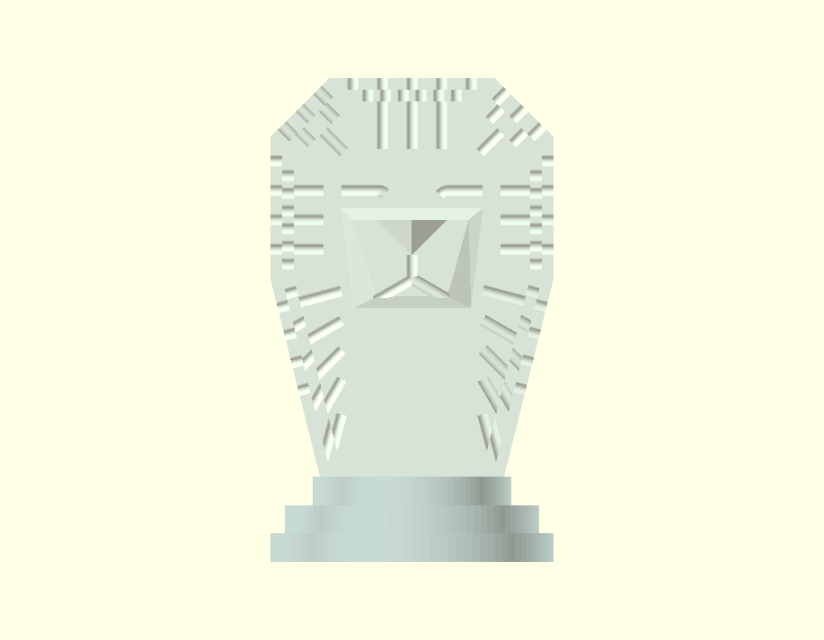
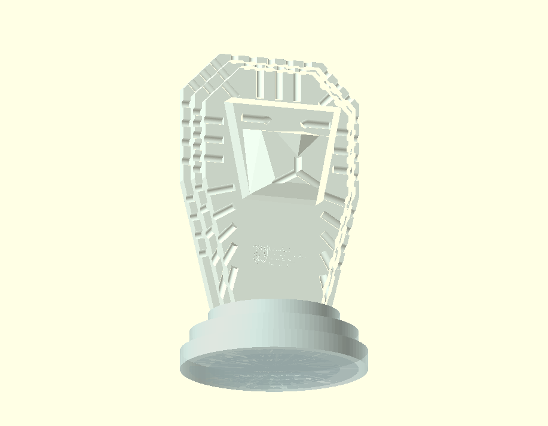
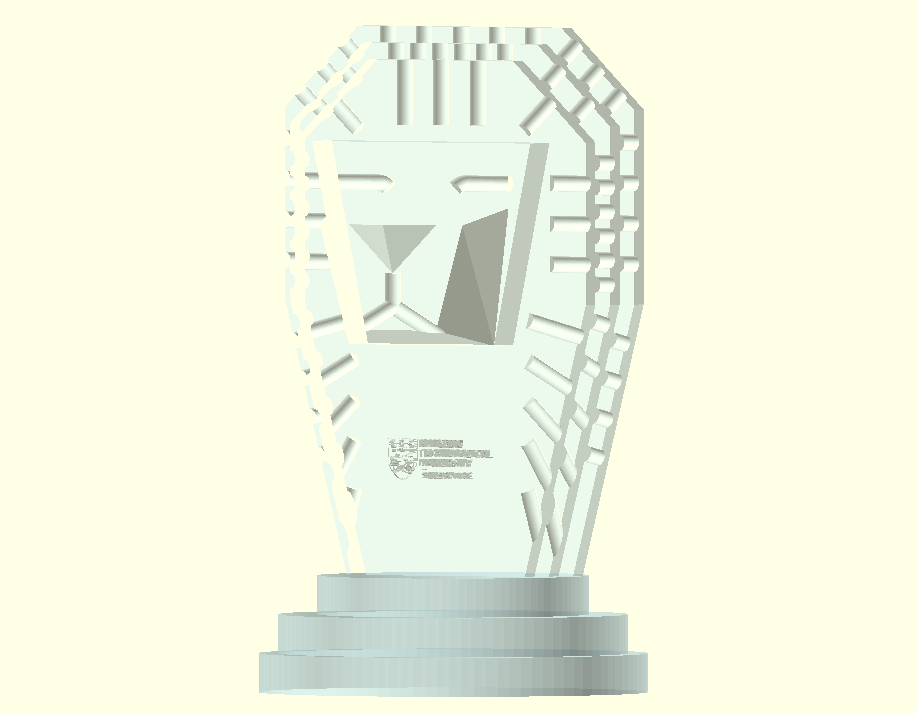
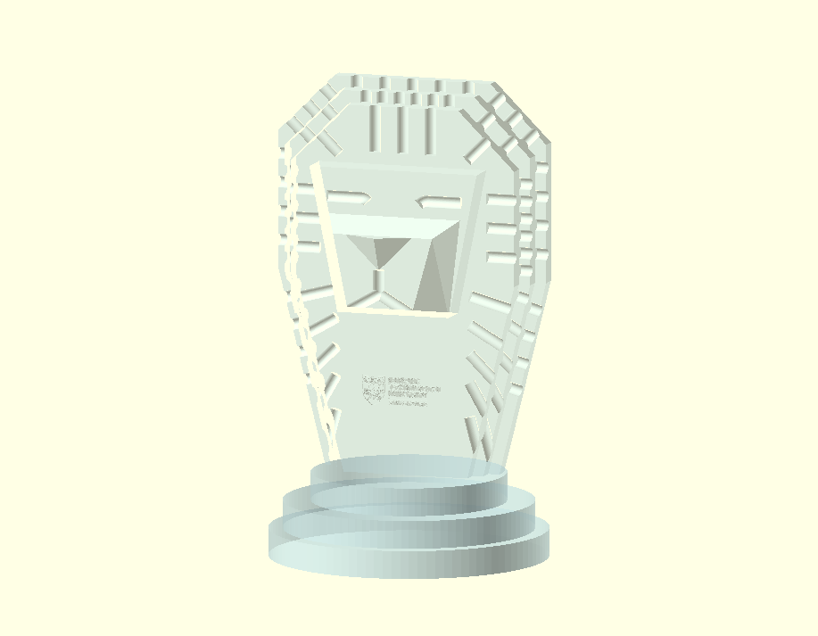

# NTU CoS Research Awards Trophy Design Competition Submission
## About
This model was designed with manufacturability in mind and an STL file as well as the original OpenSCAD model are provided.  The dimensions conform to the contest specifications; the base has a diameter of 10cm and the height does not exceed 25cm.  A 3cm wide NTU logo is engraved on the front of the model.  The intended material is crystal.

## Renderings

## Instructions
The STL file is already set for 3D printing.  To edit the model, you will need [OpenSCAD](https://openscad.org/).  Two helper scripts are provided:
1. prep_logo.py - this script takes a logo and converts it to black and white and thickens the lines so that it can be expressed as an OpenSCAD surface.  Place the output of this script in the same directory as the trophy.scad file.
2. png2vid.py - this script takes a folder on PNGs produced by OpenSCAD's animate functionality and converts it into an mp4 video.
